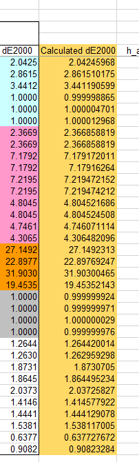
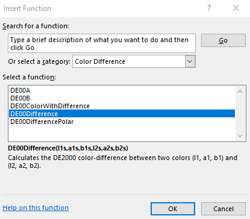

# CIEDE2000-Color-Difference

This repository provides an implementation of the [CIEDE2000 Color-Difference formula](http://www2.ece.rochester.edu/~gsharma/ciede2000/) (de00) for Mathematica, C# and Excel.
Its purpose is to calculate colors in the ab-plane of the Lab color space that have a defined color-disance when L is fixed.


The CIEDE2000 formula has several improvements, e.g. it deals with the problematic blue region. The goal is to get colors around a reference color that have a specific color-difference. In Mathematica, we can use `ContourPlot` to easily visualize this. To calculate it, we use simple scheme where we use a reference color and a certain direction, and we calculate at which distance we approach the sought color-difference.
So we try to find the root

```
0 = de00(r) - distance
```

The repository contains 

1. A prototype implementation of de00 in a Mathematica notebook to verify the correctness of the formula and to do some initial testing
2. A C# translation of the code and an algorithm to find above root along a defined direction
3. Bindings for Excel using [Excel-DNA](https://github.com/Excel-DNA) that allows to call the functionality directly as formula inside Excel.

## C# implementation and Excel-binding

The C# implementation can be found under the `Excel-CEIDE2000` directory and contains both a solution for the code and the unit tests.
It uses the following NuGet packages

- Centerspace.NMath
- ExcelDna

The unit test verifies that the error between the calculated and the published dE00 differences are below 0.0001.
You can also download an Excel sheet from the references below to check yourself in Excel what the package calculates vs the published numbers



### Inside Excel

You need to [add the Excel AddIn](https://support.microsoft.com/en-us/office/get-an-office-add-in-for-excel-d3df5854-0a4e-4169-9cc3-25177a288d3d) that you can download from the release section.
After that, you will find new Excel formula functions in a newly added "Color Distance" category.



and you can use these to, e.g. calculate the region boundary with a specific color-distance from a reference color


